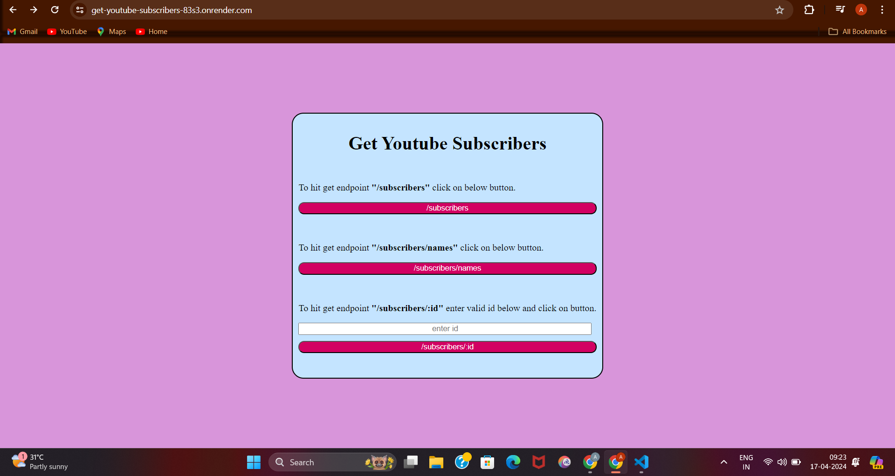
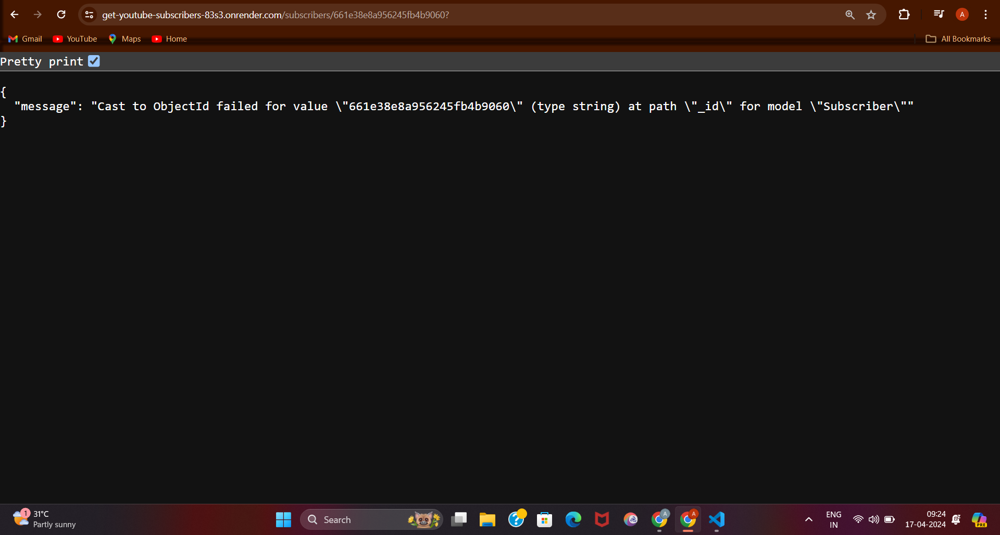

# Get Youtube Subscribers

description: The Get Youtube Subscribers is a backend project  aimed at developing a simple application using MongoDB in Node.js. In this project I had used MongoDB Atlas , Mongoose , Nodejs , Expressjs , Ejs , Css, Javascript.

For creating database I had used createDatabase.js file in src folder, for initializing data in database I had use data.js file in src folder . Server is created in index.js in src folder and all the endpoints are written in app.js in src folder . For creating home page I have used Ejs package. home.ejs exist in the views folder of src folder . in the home page I have used Css for styling and js for functionality . subscribers.js file in models folder in src folder is used to create schema for subscribers. 

## Deployment

Deployed link : https://get-youtube-subscribers-83s3.onrender.com/

## Tech Stack

Mongodb Atlas, Mongoose, Nodejs, Express, Ejs, Css, Js

## Screenshots

## Explanation : 

-In this project first the data of subscribers which consist of name, subscribedChannel, subscribedDate is initialised in database and then when we click on /subscribers button in home page then we make a get call at /subscribers endpoint that response with an array of subscribers (an Object ) .

-when we click on /subscribers/names button in home page then we make a get call at /subscribers/names endpoint that response with an array of subscribers (an Object with only two fields name and subscribedChannel ) .

-when we enter valid id in input field of home page and click on /subscribers/:id button in home page then we make a get call at /subscribers/:id endpoint that response with a subscriber (an Object) with gived id .

-when we enter Invalid id in input field of home page and click on /subscribers/:id button in home page then we make a get call at /subscribers/:id endpoint that response status codfe 400 and Error message ({message: error.message}) .

## Documentation

--Frontend:  I had used Ejs package for frontend Home page. In it I had used Css for styling and Javascript for functionality. 

--Validation:  I had used Try catch for backend validation and also applied frontend validation in form of home.ejs .

--Backend: I had used Nodejs, and Express.js for backend.

--Database : I had used MongoDB Atlas for database and mongoose for object modelling .

## Conclusion

The project utilised MongoDB atlas for database, Nodejs, Expressjs for backend, Mongoose for object modelling, Ejs for Templating home page.
 
 Css for Styling and build Get Youtube Subscribers project that make get call at /subscribers , /subscribers/names , /subscribers/:id and gets the data for each call respectively.
 
  It’s a simple backend project with home page as fronted that consist of buttons to make those calls at endpoints .
